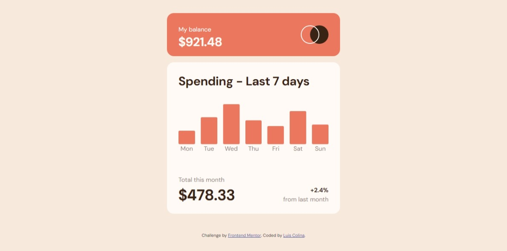

# Frontend Mentor - Expenses chart component solution

This is a solution to the [Expenses chart component challenge on Frontend Mentor](https://www.frontendmentor.io/challenges/expenses-chart-component-e7yJBUdjwt). Frontend Mentor challenges help you improve your coding skills by building realistic projects. 

## Table of contents

- [Overview](#overview)
  - [The challenge](#the-challenge)
  - [Screenshot](#screenshot)
  - [Links](#links)
- [My process](#my-process)
  - [Built with](#built-with)
  - [What I learned](#what-i-learned)
  - [Continued development](#continued-development)
  - [Useful resources](#useful-resources)
- [Author](#author)
- [Acknowledgments](#acknowledgments)

**Note: Delete this note and update the table of contents based on what sections you keep.**

## Overview

### The challenge

Users should be able to:

- View the bar chart and hover over the individual bars to see the correct amounts for each day
- See the current day’s bar highlighted in a different colour to the other bars
- View the optimal layout for the content depending on their device’s screen size
- See hover states for all interactive elements on the page
- **Bonus**: Use the JSON data file provided to dynamically size the bars on the chart

### Screenshot




### Links

- Repository URL: [github repo url](https://github.com/Silkiercomet/7-days-chart)
- Live Site URL: [live site URL](https://silkiercomet.github.io/7-days-chart/)

## My process

### Built with

- Semantic HTML5 markup
- CSS custom properties
- Flexbox
- CSS Grid
- Mobile-first workflow

### What I learned

The porpuse of this project was to slowly get back into coding shape, it toke me around 3 hours to completly and my mistakes were more out being rusty than a lack of knowledge

There was a interesthing part of this challenge that was to dynamically show the chart values and this is how i did it

```js
const addCharts = async () => {
  // getData is an async function that return a promise so we need to await it to resolve
    const data = await getData()
  // for each value present in the result we create a bar element, assing his class and also amount
    data.forEach((element,i) => {
        const bar = document.createElement('div');
        // it shows the amount on hover present in the bar
        const amount = document.createElement('div');
        amount.classList.add("amount");
        bar.classList.add('chart-bar');
        amount.textContent = `$${element.amount}`
        // the height of the bar is set to his value divide by 100 and multiply by the minimun container height 
        const barHeight = (element.amount / 100) * 200; 
        bar.style.height = `${barHeight}px`;
        bar.appendChild(amount)
        bars[i].prepend(bar);
    });
}
```

### Continued development

The display of data in this project was fairly simple but i'll like to know more about more complex data structures 

### Useful resources

- [Gemini AI](https://gemini.google.com/app) - This helped me to create the ecuation for the height of the bar. I really liked this pattern and will use it going forward.

## Author

- Website - [My portfolio](https://luis-colina-portfolio.netlify.app/)
- Frontend Mentor - [@yourusername](https://www.frontendmentor.io/profile/Silkiercomet)


